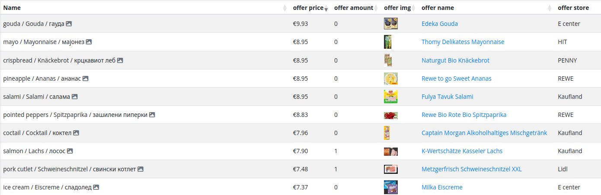
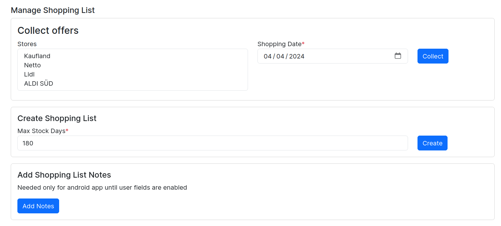
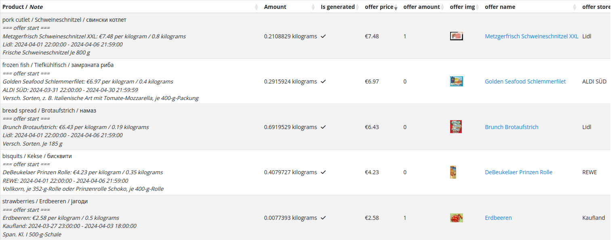
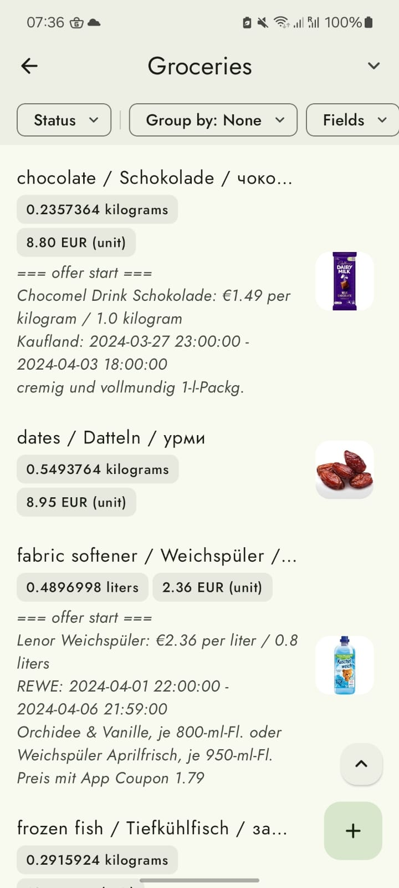
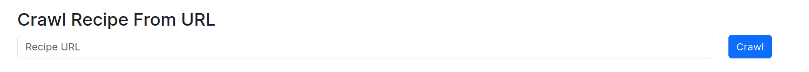
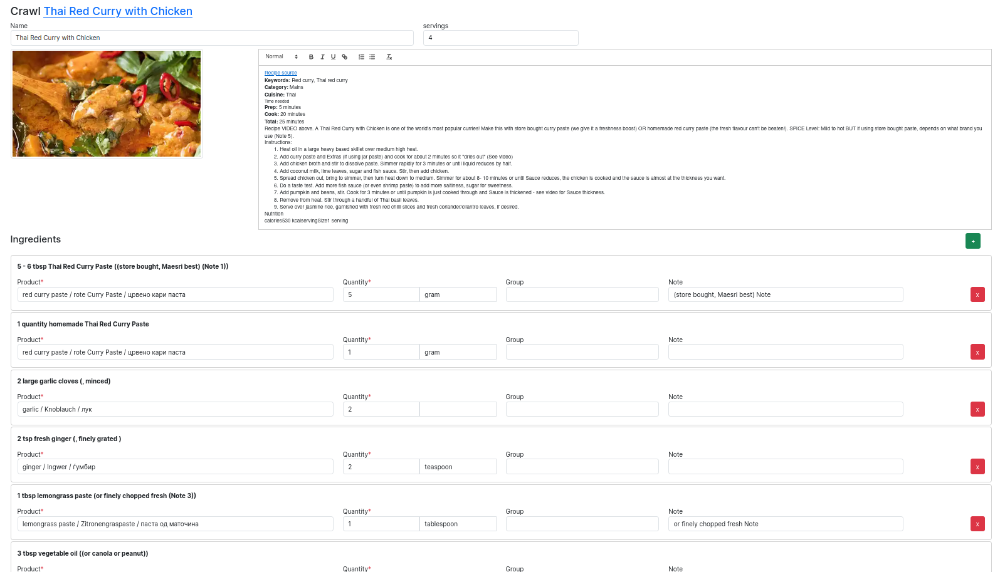
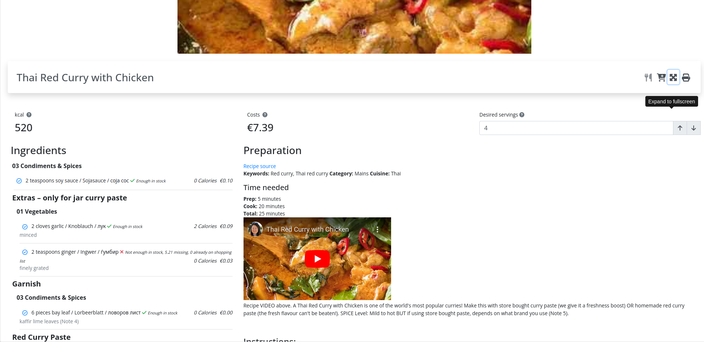
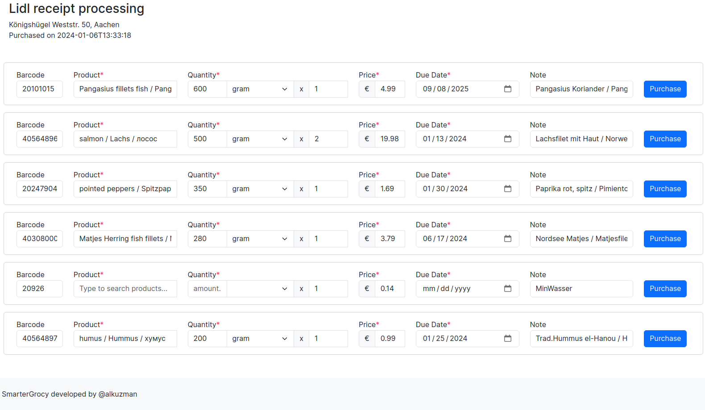

# Grocy Experimental Features

This is application implements some experimental features for [Grocy](https://github.com/grocy/grocy).
The main goal is to work with Grocy in the background, do most thigs automatically so you can keep using 
[Grocy](https://github.com/grocy/grocy), [Grocy Android](https://github.com/patzly/grocy-android), 
[Home Assistant Grocy Addon](https://github.com/hassio-addons/addon-grocy) etc. Therefore, it uses Grocy
as a database while utilizing the UserField functionality extensively.

### Client Application
See the [React Client](https://github.com/klupp/grocy-experimental-features-client?tab=readme-ov-file).

# Getting Started
_NOTE: This app is released prematurely since it contains some specific rule that we used for our setup 
which might not be transferable in other environments. For example all our product names have 3 translations 
English, German, and Macedonian separated by ` / `. Some features use English name and some German. 
We intend to make this configurable and even use separate UserFields._

1. You just need to install the python dependencies listed in the `requirements.txt`.
2. Provide `config.yml` with API keys of the services you want to use. Some are critical. See config_example.yml.
3. Start the main.py with uvicorn server. For more info see the [FastAPI](https://fastapi.tiangolo.com/tutorial/first-steps/) documentation.

_NOTE: Your Grocy server must be available to start the application._

### API Docs
once you start the server you can see all the available API calls on [http://localhost:5000/api/docs](http://localhost:5000/api/docs)

# Features
The features developed here are purely of experimental nature. However, we intend to make them stable
for production use. They will be removed in case the main Grocy project implements them, but as it seems
some of them will never be in the scope of that project.

### Automatic collecting of offers
Works in Germany only for now.
Collects offers and maps them to your Grocy products so they are visible on your Grocy interface.
Offers store the following information:
- store
- price
- product
- image
- whether you need app or card for the price to apply
- amount offered
- brand of product
- description

*Offers shown on your Grocy server.*

### Automatic Shopping List 
based on past consumption habits and current stock. It also collects offers to adjust your stock.
It tells you to buy more or earlier of some product if the current offer price is lower than your history of purchases.
Therefore saving you money. It will also find the cheapest store for given product and recommend to buy it there.

*Grocy experimental view for shopping list management.*

*Shopping List on Grocy server*

*Shopping List on Android*

### Automatic Recipe Importer
similar to [Recipe Buddy](https://github.com/georgegebbett/recipe-buddy).

However, this one will prefill quantity units amounts and even products (if any found in you database) automatically, 
leaving just few checks here and there for you :). It does this by making a fuzzy search in your Grocy database and 
NLP processing to extract quantity data from string.

*Recipe form.*

*Automatically collected data without any user intervention.*

*Imported Recipe in Grocy*

### Automatic importing of Store Receipts 
from some German stores: 
- Lidl
- Kaufland
- Netto (they just changed their api from JSON to SOAP, it loads only old receipts)
- REWE (Not Stable)
- DM (Not stable)

so far. 

The automatic prefilling of fields works here too. 

*Receipt form. The data on the screen is completely automatically generated.*

### Automatic updating of existing products
data from OpenFoodFacts.